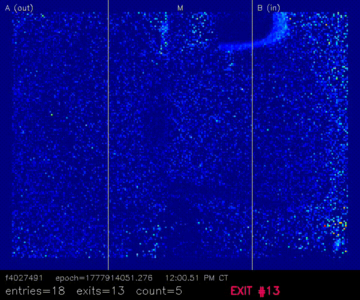
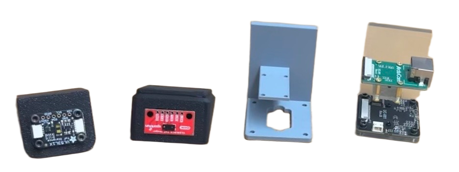

<p align="center">
  
</p>


<p align="center">
  <a href="https://upl.cs.wisc.edu"></a>
  
  
  
</p>


The UPL is a computer science lab on the second floor of Morgridge Hall at UW-Madison. People wander in and out all day, and "how many people are in the lab right now" is a common question. Is anyone there before I bike over in ten below? Is my project partner in the lab? Door Counter v3 is the sensor above the door that answers these questions. If you've opted in, it also knows when *you* specifically are inside. The margin of error for *regular entries* and exits is **sub 0.5%.**

It's a Raspberry Pi with two sensors: a time-of-flight depth camera pointed straight down at the doorway, and a BLE scanner listening for the phones of registered members. A fusion layer called the **Detective** matches the two up. Every 20 seconds the Pi commits the count to this repo, which feeds the [live count on the UPL site](https://upl.cs.wisc.edu) and `/who` in the Discord (bot lives at [UW-UPL/door-counter-v3-bot](https://github.com/UW-UPL/door-counter-v3-bot)). Just paired your phone? Look for your device in [`data/pending.json`](./data/pending.json).


### 1. Counting (the depth camera)

A ToF (Time of Flight) camera is mounted about 2.4 m up, looking straight down at the floor. Per frame:

| Step | Technique |
|------|-----------|
| Floor calibration | A per-pixel reference of the empty doorway, captured once by `tools/calibrate.py`. |
| Heightmap | Subtract each frame from the floor reference. Now everything is "mm above the floor". |
| Head detection | **h-maxima**: keep peaks that rise at least 250 mm above their surrounding saddle. Head-to-shoulder drop is about 250 mm, so two people walking shoulder to shoulder still read as two peaks. |
| Splitting | When blobs touch, **watershed segmentation** cuts them apart. |
| Tracking | A **Kalman filter** per head, matched frame to frame with the **Hungarian algorithm**. |
| Counting | Two tripwire lines split the frame into three zones: **A** (Commons), **M** (middle), **B** (UPL). A full A → M → B traversal is an entry, B → M → A is an exit. Lean in and change your mind? Not counted. |

The ST7789 LCD on the wall renders the heightmap live in false color. It serves no functional purpose. It looks sick.

### 2. Recognizing (BLE)

The Pi passively scans BLE advertisements and keeps a short RSSI history per registered device. No connection, no GATT, no battery cost. Your phone is already shouting these packets into the void, we just write down how loud they are. Devices not in [`data/registrations.json`](./data/registrations.json) are not tracked at all.

### 3. The Detective

When the camera says "someone just walked in," the Detective decides which registered device, if any, that person was carrying. It scores every candidate over the last 60 seconds of signal:

| Feature | Weight | What it captures |
|---------|--------|------------------|
| **Recency** | 0.20 | How recently we heard the device. Exponential decay with a 15 s time constant. |
| **RSSI trend** | 0.40 | Slope of the signal (plain linear regression). Someone walking toward the door gets louder. |
| **RSSI strength** | 0.40 | Mean of the last 3 readings, scaled between -90 and -30 dBm. |

Best score over 0.25 gets claimed. That's the snap judgment, tuned to update `/who` fast at the door. Then every 10 seconds a garbage-collector thread re-judges everyone over a 5 minute window with different weights (consistency 0.35, strength 0.35, trend 0.30): it boots devices that went silent, fills in people the snap judgment missed, and swaps anyone out if a non-active device outscores them by 0.10. Fast at the door, correct five minutes later.

The count survives restarts (SQLite in `data/`) and force-resets to zero once a day, because drift is inevitable.

### 4. Talking to the world

Every 20 seconds the Pi pulls this repo, ingests new registrations, writes [`data/count.json`](./data/count.json) and [`data/pending.json`](./data/pending.json), and pushes. The website and Discord bot are just consumers of `count.json`. Yes, the deploy pipeline is git: it's free, it's auditable, and the Pi never has to accept an inbound connection.

## Hardware

| Part | Qty | Notes |
|------|-----|-------|
| Raspberry Pi 4B (4 GB+) | 1 | Should work with anything Pi4 and later. |
| Arducam ToF Camera (B0410) | 1 | MIPI-CSI, 240×180 depth, 0.4 m to 4 m range. Our floor sits at ~2.4 m. |
| ST7789 SPI LCD, 320×240 | 1 | 3.3 V logic, 8 wires off the GPIO header. |
| Built-in BLE radio | 1 | No dongle needed. |
| Official Pi 27 W USB-C PSU | 1 | The camera plus LCD pulls more than a phone charger likes. |

<p align="center">
  
</p>

<p align="center"><em>the progression of sensor + mounts over time, left to right: Adafruit VL53L1X w/ mount v1, SparkFun VL53L5CX w/ mount v2, mount v3 in PLA, Arducam ToF Camera w/ mount v3 in resin</em></p>

### Opting in to be recognized

One-time setup, all through git:

1. Open Bluetooth settings on your phone, find **`upl-door-counter`**, hit **Pair**. Remember the 6-digit passkey.
2. Find your passkey in [`data/pending.json`](./data/pending.json). Pending entries expire after about 10 minutes, so if you miss the window, re-pair.
3. Open a PR adding yourself to [`data/registrations.json`](./data/registrations.json):

```json
{
  "passkey": "428193",
  "paired_at": "2026-05-22T18:04:00",
  "name": "ollie",
  "share_presence": true
}
```

| Field | Required | Notes |
|-------|----------|-------|
| `passkey` | yes | The 6-digit code from pairing. Must match an entry in `pending.json`. |
| `paired_at` | yes | ISO 8601. Used to check the pending entry hasn't expired. |
| `name` | yes | Shown in `/who` and on the website. Keep it short. |
| `share_presence` | no | Default `false`. If `false` you count toward the total but your name is never published. |
| `sound_file` | no | A file in `sounds/custom/` that plays when you walk in. The speakers are not hooked up yet, so for now this field is pure aspiration. |

4. A coordinator merges it and the Pi picks you up within 20 seconds. After that you show up whenever your phone is in the lab with Bluetooth on.

Alongside the PR flow above is a nice-to-have API endpoint that can do steps 2 and 3 for you, see [Contributing](#contributing).

### How the pairing actually works

<details>
<summary>BlueZ DBus agent details</summary>

The Pi runs a custom BlueZ agent on `org.bluez.Agent1` registered with `DisplayYesNo` capability. When your phone initiates pairing:

1. The passkey arrives in the `RequestConfirmation` callback. The agent records it, along with your MAC and a timestamp, into the pending table.
2. The agent accepts the pairing and waits ~10 seconds for the key exchange to finish. This step is the whole point: completing the exchange is what reveals your **Identity MAC**, since the address your phone normally advertises is a rotating random one.
3. Then it disconnects. We never use the Bluetooth connection for anything, we only wanted the MAC for passive scanning. Any service access request is flat-out rejected.

If a registration PR referencing your passkey lands within 10 minutes, the MAC is promoted to the tracked set. Otherwise the entry ages out of `pending.json` and is never promoted.

</details>

### Privacy

- Opt-in only. The Pi only learns your Identity MAC if you pair with it, and only acts on it if you're in `registrations.json`.
- `share_presence: false` keeps you in the count but never in the names list.
- The camera is a depth sensor, not an RGB camera. It sees the height of the doorway 30 times a second. It cannot see faces, clothes, or skin. It can sense your intentions though so keep that in mind...
- Everything the system publishes flows through this public repo, so what you can read here is exactly what gets stored.

### Repo layout

```
src/
  main.py      starts the five threads and babysits them
  tof/         camera loop, vision pipeline, zone counter
  ble/         scanner, RSSI history, pairing agent, the Detective
  services/    github sync, sqlite, logging, audio (never hooked up)
  display/     ST7789 driver + live heightmap renderer
tools/         calibrate / record / replay / visualize
hardware/      STL for mount v3
frontend/      SvelteKit demo wrapping the netlify function endpoints (not deployed)
netlify/       2 functions: read pending.json, open registration PRs (deployed)
sounds/        entry jingles for speakers that are not hooked up yet
data/          count.json, pending.json, registrations.json, sqlite db
```

### Contributing

UPL members, feel free to contribute. Rough order of things that might be fun to contribute:

1. Finish the pairing web UI as an alternative to hand-writing PRs:
   - [`netlify/functions/`](./netlify/) holds two endpoints, deployed at `https://gregarious-cocada-36aa36.netlify.app/.netlify/functions/`: GET `pending-devices` and POST `registrations`.
   - [`frontend/`](./frontend/) is a reference demo that calls both endpoints.
   - If you want to redeploy `netlify/` to your own Netlify site, set the environment variables: `GITHUB_BOT_TOKEN`, `PUBLIC_REPO_OWNER`, and `PUBLIC_REPO_NAME`.
2. Replace GitHub-as-database with something real. Current rec: a small hosted Postgres (Supabase free tier), with the Pi POSTing over HTTPS so it stays outbound-only.
3. Hook up the speakers. The per-person entry jingle system is fully designed, `sound_file` is already in the schema, and there is exactly one wav sitting in `sounds/custom/` waiting for its moment.
4. Dim the LCD when nobody is around.

### Acknowledgements

Built in the UPL, for the UPL. Thanks to Prof. Barton Miller for keeping the lab alive since the 1980s, and to the folks whose phones and heads spent a semester being test subjects :^)

### License

MIT.
